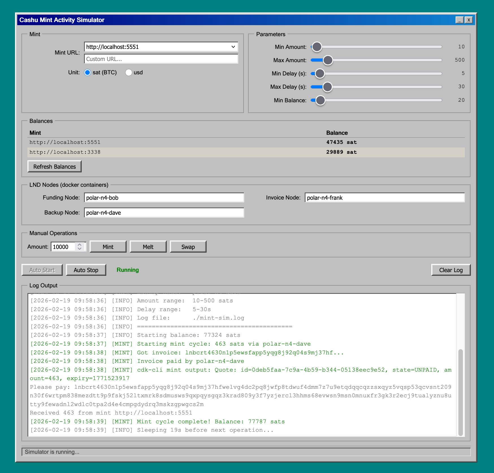

# Mint98

A tool for generating realistic traffic against [Cashu](https://cashu.space/) mints. Continuously runs mint, melt, and swap operations using `cdk-cli` and Polar Lightning nodes.

Includes a Windows 98-themed web GUI for adjusting parameters, viewing per-mint balances, and running manual operations.



## Prerequisites

- [cdk-cli](https://github.com/cashubtc/cdk) built and available
- [Polar](https://lightningpolar.com/) with LND nodes running
- Node.js 18+

## Setup

```bash
npm install
```

## Usage

### Web GUI

```bash
npm start
```

Open http://localhost:3999. From the GUI you can:

- Select a mint and unit type (sat/usd)
- Adjust amount ranges, delay, and balance thresholds
- Configure LND node container names
- View balances per mint
- Run manual mint/melt/swap operations
- Start/stop the auto simulator loop

### CLI only

Run the simulator directly:

```bash
MINT_URL=http://localhost:3338 ./mint-activity-sim.sh
```

Single operations:

```bash
./mint-activity-sim.sh balance
./mint-activity-sim.sh mint 100
./mint-activity-sim.sh melt 50
./mint-activity-sim.sh swap 75
```

### Environment Variables

| Variable | Default | Description |
|----------|---------|-------------|
| `MINT_URL` | `http://localhost:5551` | Target mint |
| `UNIT` | `sat` | `sat` or `usd` |
| `CDK_CLI` | `~/Sites/cdk/target/release/cdk-cli` | Path to cdk-cli binary |
| `MIN_AMOUNT` | `10` | Minimum operation amount |
| `MAX_AMOUNT` | `500` | Maximum operation amount |
| `MIN_DELAY` | `5` | Minimum delay between ops (seconds) |
| `MAX_DELAY` | `30` | Maximum delay between ops (seconds) |
| `FUNDING_NODE` | `polar-n4-bob` | Docker container that pays invoices to the mint |
| `INVOICE_NODE` | `polar-n4-frank` | Docker container that receives payments from the mint |
| `BACKUP_NODE` | `polar-n4-dave` | Alternate node for variety |
